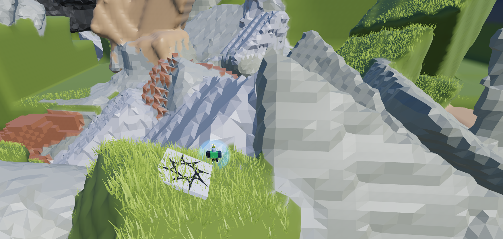

# Terrain Editor Fork

An expanded version of Roblox Studio's terrain tools. More shapes, more tools, more control.

---

## What's Different

The built-in terrain editor is fine for basics. This one goes further:

- **14 brush shapes** instead of 3
- **25 tools** across sculpting, painting, and advanced categories
- **Per-axis sizing** and **rotation** for most shapes
- **Hollow mode** for caves and shells
- **Plane lock** for precision work
- **Clone tool** for copying terrain
- **Bridge builder** with multiple path styles

---

## Sculpting Tools

| Tool | What it does |
|------|--------------|
| **Add** | Build terrain up. The basic tool. |
| **Subtract** | Carve terrain away. Make holes, caves, tunnels. |
| **Grow** | Gently expand from existing surfaces. Organic swelling. |
| **Erode** | Wear terrain down from edges. Natural weathering. |
| **Smooth** | Blend rough edges and soften transitions. |
| **Flatten** | Level terrain to a plane. Grow-only, Erode-only, or Both. |
| **Noise** | Add procedural roughness. Adjustable scale, intensity, seed. |
| **Terrace** | Create stepped layers like rice paddies or hillside farms. |
| **Cliff** | Force vertical faces. Drag to set the cliff direction. |
| **Path** | Carve channels with V, U, or flat-bottom profiles. |
| **Clone** | Ctrl+Click to capture, then stamp copies elsewhere. |
| **Blobify** | Organic blob distortion. Melted, lumpy surfaces. |

---

## Painting Tools

| Tool | What it does |
|------|--------------|
| **Paint** | Change material without changing shape. |
| **Gradient** | Blend between two materials along an axis. |
| **Slope Paint** | Auto-texture based on surface angle—grass on flats, rock on steeps. |
| **Flood** | Fill brush area with material. Replace all or specific materials only. |
| **Cavity Fill** | Paint into dips and crevices. Good for dirt in cracks. |
| **Randomize** | Scatter weighted random materials in clustered patches. |
| **Melt** | Simulate terrain flowing downward. Dripping, sagging effects. |

---

## Advanced Tools

| Tool | What it does |
|------|--------------|
| **Bridge** | Connect two points with terrain. Multiple curve styles. |
| **Growth** | Simulate organic expansion—coral, crystal, or organic patterns. |
| **Stalactite** | Create hanging or protruding spikes. Caves and alien terrain. |
| **Tendril** | Branching vine-like structures. Roots, vines, tentacles. |
| **Symmetry** | Mirror strokes around a center axis. 2 = mirror, 4+ = mandala. |
| **Grid** | Divide terrain into cells with random height variation. Blocky landscapes. |

---

## Brush Shapes

### Standard Shapes

| Shape | Sizing | Rotation |
|-------|--------|----------|
| **Sphere** | Uniform | — |
| **Cube** | X, Y, Z | ✓ |
| **Cylinder** | X, Y, Z | ✓ |
| **Wedge** | X, Y, Z | ✓ |
| **Corner Wedge** | X, Y, Z | ✓ |
| **Dome** | X, Y, Z | — |

### Creative Shapes

| Shape | Description |
|-------|-------------|
| **Torus** | Donut ring. Carve craters, build raised rings. |
| **Ring** | Flat washer. Circular paths, moats. |
| **ZigZag** | Z-shaped profile. Angular, industrial. |
| **Sheet** | Curved surface, like bent paper. |
| **Grid** | 3D checkerboard pattern. |
| **Stick** | Long thin rod. Precision lines. |
| **Spikepad** | Flat base with spikes on top. |

---

## Bridge Tool

Click once for start, click again for end. A terrain bridge connects them.

**Bridge Styles:**
- **Arc** — smooth curve upward
- **Sinusoidal** — gentle wave
- **Blippy** — short bumps
- **SquareWave** — stepped pattern
- **Rollercoaster** — dramatic hills
- **TwistySwingly** — curves side to side
- **MegaMeander** — wild flying path that soars and swoops

Adjustable width and meander. Preview shows the path before you commit.

---

## Brush Modifiers

### Hollow Mode

Turn any shape into a shell. Adjustable wall thickness (10%–50%).

Good for caves, domes, tunnels, hollow mountains.

### Spin Mode

The brush rotates continuously while you paint. Creates organic, twisted forms.

### Pivot Position

Where the brush anchors to your cursor:
- **Bottom** — brush sits on top of terrain
- **Center** — brush centered on cursor
- **Top** — brush hangs below cursor

---

## Plane Lock

Constrain your brush to a horizontal plane.

| Mode | Behavior |
|------|----------|
| **Off** | Normal—brush follows terrain surface |
| **Auto** | Locks to the height where you first click, releases when you let go |
| **Manual** | Set a specific height, or click "Set from Cursor" |

The locked plane shows as a green disc.

---

## Controls

### Keyboard

| Key | Action |
|-----|--------|
| **R** | Lock/unlock brush in place |
| **Shift + Scroll** | Adjust primary brush dimension |
| **Shift + Alt + Scroll** | Adjust secondary brush dimension |
| **Ctrl + Scroll** | Adjust brush strength |
| **Ctrl + Click** | Set clone source / gradient start |
| **Alt + Click** | Sample material from terrain |

### Shape-Specific Sizing

Different shapes have different sizing axes:

| Shape | Primary (Shift+Scroll) | Secondary (Shift+Alt+Scroll) |
|-------|------------------------|------------------------------|
| **Sphere** | Size (uniform) | — |
| **Cube** | XZ (footprint) | Y (height) |
| **Cylinder** | Radius | Height |
| **Wedge** | XZ (footprint) | Y (height) |
| **CornerWedge** | XZ (footprint) | Y (height) |
| **Dome** | Radius | Height |
| **Torus** | Ring Radius | Tube Radius |
| **Ring** | Radius | Thickness |
| **Stick** | Length | Thickness |
| **Spikepad** | Base Size | Spike Height |

### When Brush is Locked

- Brush turns **orange** and stays put
- **Drag orange rings** to rotate
- **Drag cyan arrows** to resize per-axis
- Press **R** again to unlock

---

## Materials

22 terrain materials with visual tile previews:

Grass, Sand, Rock, Ground, Snow, Ice, Glacier, Water, Mud, Slate, Concrete, Brick, Cobblestone, Asphalt, Pavement, Basalt, Cracked Lava, Salt, Sandstone, Limestone, Leafy Grass, Wood Planks

---

## Screenshots




---

## Setup

### First Time

Build the loader plugin once:

```powershell
rojo build loader.project.json -o "YOUR_PLUGINS_FOLDER/TerrainEditorLoader.rbxm"
```

### Every Time

```powershell
rojo serve
```

Then in Studio: Connect via Rojo, and click **Reload** after making changes.

---

## Source

Extracted from [Roblox-Client-Tracker](https://github.com/MaximumADHD/Roblox-Client-Tracker), commit `581236f` (May 2022). Modified and extended for more capabilities.
